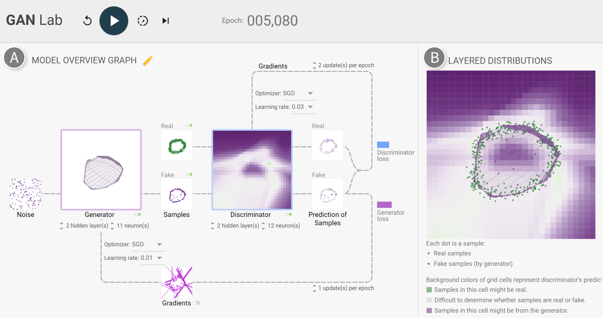

# GAN Lab: An Interactive, Visual Experimentation Tool for Generative Adversarial Networks

By 
[Minsuk Kahng](http://minsuk.com),
[Nikhil Thorat](https://twitter.com/nsthorat),
[Polo Chau](https://www.cc.gatech.edu/~dchau/),
[Fernanda Viégas](http://fernandaviegas.com/), and 
[Martin Wattenberg](http://www.bewitched.com/)

**_Please note that the source code and demo in this repository are provided for reviewers of our research paper under review. GAN Lab will be officially announced by the authors later._**

## Overview

GAN Lab is a novel interactive visualization tool for anyone to learn and experiment with Generative Adversarial Networks (GANs), a popular class of complex deep learning models. With GAN Lab, you can interactively train GAN models for 2D data distributions and visualize their inner-workings, similar to [TensorFlow Playground](http://playground.tensorflow.org/).

GAN Lab uses [TensorFlow.js](https://js.tensorflow.org/), an in-browser GPU-accelerated deep learning library. Everything, from model training to visualization, is implemented with JavaScript. Users only need a web browser like Chrome to run GAN Lab. Our implementation approach significantly broadens people's access to interactive tools for deep learning. 




## Working Demo

Click the following link:

[https://poloclub.github.io/ganlab/](https://poloclub.github.io/ganlab/)

It runs on most modern web browsers. We suggest you use Google Chrome.


## Development

This section describes how you can interactively develop GAN Lab.

### Install Dependencies

Run the following commands: 

```bash
$ git clone https://github.com/poloclub/ganlab.git
$ cd ganlab
$ yarn prep
```

It's unlikely, but you may need to install some basic JavaScript-related dependencies (e.g., yarn).


### Running Your Demo

Run the following command:

```bash
$ ./scripts/watch-demo

>> Waiting for initial compile...
>> 3462522 bytes written to src/bundle.js (2.17 seconds) at 00:00:00
>> Starting up http-server, serving ./
>> Available on:
>>   http://127.0.0.1:8080
>> Hit CTRL-C to stop the server
```

Then visit `http://localhost:8080/src/`. 

The `watch-demo` script monitors for changes of typescript code (e.g., `src/ganlab.ts`)
and compiles the code for you.


## Credit

GAN Lab was created by 
[Minsuk Kahng](http://minsuk.com),
[Nikhil Thorat](https://twitter.com/nsthorat),
[Polo Chau](https://www.cc.gatech.edu/~dchau/),
[Fernanda Viégas](http://fernandaviegas.com/), and 
[Martin Wattenberg](http://www.bewitched.com/),
which was the result of a research collaboration between Georgia Tech and Google Brain.
We also thank Shan Carter and Daniel Smilkov, 
[Google Big Picture team](https://research.google.com/bigpicture/) and 
[Google PAIR](https://ai.google/research/teams/brain/pair), and 
[Georgia Tech Visualization Lab](http://vis.gatech.edu/)
for their feedback.
 
For more information, check out 
[our research paper](http://minsuk.com/research/papers/kahng-ganlab-vast2018.pdf):     
 
[Minsuk Kahng](http://minsuk.com),
[Nikhil Thorat](https://twitter.com/nsthorat)
[Polo Chau](https://www.cc.gatech.edu/~dchau/),
[Fernanda Viégas](http://fernandaviegas.com/), and 
[Martin Wattenberg](http://www.bewitched.com/).
"GAN Lab: Understanding Complex Deep Generative Models using Interactive Visual Experimentation."
*IEEE Transactions on Visualization and Computer Graphics, 25(1) ([VAST 2018](http://ieeevis.org/year/2018/welcome))*, Jan. 2019.
